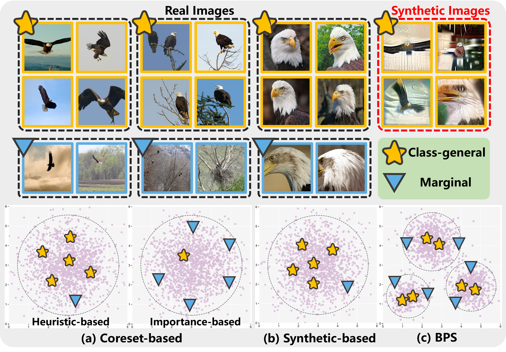
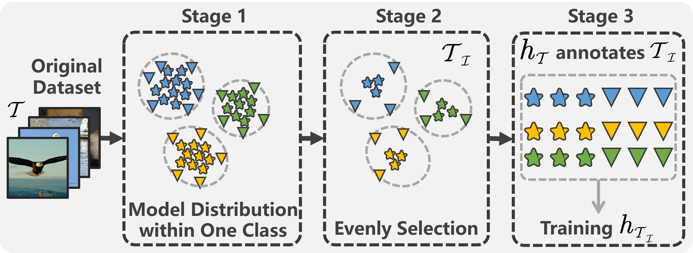
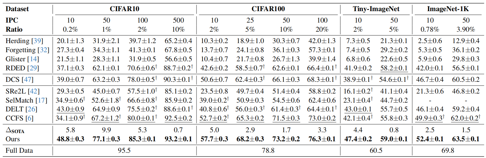

# Balanced Dataset Distillation via Modeling Multiple Visual Pattern Distribution

This repo contains PyTorch implementation of **Balanced Dataset Distillation via Modeling Multiple Visual Pattern Distribution (BPS, CVPR 2026)**. BPS produces a pattern-balanced condensed dataset via modeling the multiple visual pattern distribution within each class. This repo contains code for conducting BPS on CIFAR-10/100, Tiny-ImageNet, and ImageNet-1K. For more details please check our paper BPS.

<p align="center">

</p>


# Abstract

Dataset Distillation (DD) aims to compress large-scale datasets into a small number of condensed Images Per Class (IPC), enabling efficient network training. Previous coreset selection and synthetic-based DD methods achieve reasonable performance. However, our in-depth investigation reveals that existing methods share a common issue: **pattern imbalance**. Specifically, they either overemphasize class-general patterns representing the majority of each class or focus on fewer marginal patterns critical for model generalization. To address this issue, we propose a novel framework, **Balanced Patterns Selection (BPS)**. Unlike prior methods that assume each class forms a single cluster, BPS models the multiple visual pattern distribution within each class via a hierarchical semantic structure inherent to the dataset. It then selects two complementary subsets in a balanced manner from the center (class-general patterns) and the margins (marginal patterns) of each pattern, producing a pattern-balanced coreset. Theoretically, we prove that the BPS-selected coreset aligns with the original dataset in both information coverage and performance. Moreover, its model-agnostic selection nature ensures cross-architecture generalization, while the Optimize-Once-for-All-IPCs property guarantees efficiency. Extensive experiments on four benchmarks demonstrate that BPS significantly outperforms existing state-of-the-art methods.


# Overview

<p align="center">

</p>

BPS consists of a three-stage pipeline:

1. **Stage 1 — Modeling the Visual Pattern Distribution**: Trains an encoder to model the multi-pattern distribution within each class via inferring a hierarchical semantic structure of the dataset at the `instance → pattern → class` levels.
2. **Stage 2 — Pattern-Balanced Coreset Selection**: Evenly selects samples from pattern centers (class-general patterns) and margins (marginal patterns) to build a pattern-balanced coreset based on the modeled visual pattern distribution.
3. **Stage 3 — Distillation Training**: Trains a student model on the selected coreset.


# Results

Performance comparison (%) of BPS with SOTAs. The validation model is ResNet-18.

<p align="center">

</p>


# Installation

Setup the conda environment and install the required packages by running the following commands:
```bash
conda env create -f environment.yml
conda activate bps
```


## Preparation

**Teacher Checkpoints**: Thanks to [CCFS](https://github.com/CYDaaa30/CCFS) and [SRe2L](https://github.com/VILA-Lab/SRe2L), a pretrained ResNet-18 is used as the teacher model for relabeling and distillation training during Stage 3.  The teacher checkpoints can be downloaded from [CCFS](https://github.com/CYDaaa30/CCFS/tree/main/checkpoints) and placed in the `checkpoints/` directory. For ImageNet-1K, the official torchvision pretrained ResNet-18 is used.

**Datasets**: Prepare your datasets in the standard format:

- CIFAR-10/100: Will be automatically downloaded to `datasets/CIFAR/`.
- Tiny-ImageNet: Will be automatically downloaded to `datasets/`.
- ImageNet-1K: Should be prepared manually. Please organize it in the standard class-folder layout:

```text
datasets/ILSVRC2012/
├── train/
│   ├── n01440764/
│   │   ├── *.JPEG
│   └── ...
└── val/
    ├── n01440764/
    │   ├── *.JPEG
    └── ...
```


## Training

We provide end-to-end scripts in [`script/`](script/) that run all three stages sequentially. For example:

**CIFAR-10:**
```bash
cd script
bash run_cifar10.sh
```

**CIFAR-100:**
```bash
cd script
bash run_cifar100.sh
```

**Tiny-ImageNet:**
```bash
cd script
bash run_tinyimagenet.sh
```

**ImageNet-1K:**
```bash
cd script
bash run_imagenet.sh
```


## Running Individual Stages

You can also run each stage independently:

**Stage 1 :**

```bash
CUDA_VISIBLE_DEVICES=0,1 python stage1_modeling.py \
  --dist-url tcp://localhost:10003 --multiprocessing-distributed --world-size 1 --rank 0 \
  --arch resnet18 --dataset CIFAR100 --img_size 224 \
  --data_dir ./datasets/CIFAR \
  --exp_dir ./output_dir/cifar100_lr002_t05 \
  --lr 0.02 --epochs 30 --batch_size 256 \
  --mlp --aug-plus --cos --moco-t 0.5
```

**Stage 2 :**

```bash
CUDA_VISIBLE_DEVICES=0 python stage2_selection.py \
  --dist-url tcp://localhost:10004 --multiprocessing-distributed --world-size 1 --rank 0 \
  --resume ./output_dir/cifar100_lr002_t05/checkpoint_0030.pth.tar \
  --dataset CIFAR100 --data_dir ./datasets/CIFAR --arch resnet18 \
  --exp_dir ./output_dir/cifar100_lr002_t05 \
  --ipc 10 --seed 1228 \
  --entropies-path ./script/CIFAR100_train_entropies.npy \
  --gmm-uncertainty-percentile 0.1 \
  --hybrid-gmm-centroid-ratio 0.5
```

**Stage 3 :**

```bash
CUDA_VISIBLE_DEVICES=0 python stage3_training.py \
  --dataset CIFAR100 \
  --ipc 10 \
  --distilled-data-path ./output_dir/cifar100_lr002_t05/distilled_dataset_ipc10_k0.1_hybrid_ratio0.5 \
  --real-data-path ./datasets/CIFAR \
  --teacher-resume ./checkpoints/resnet18_cifar100_200epochs.pth \
  --teacher-arch resnet18 \
  --student-arch resnet18 \
  --output-dir ./distilled_training_results/cifar100_lr002_t05/distilled_dataset_ipc10_k0.1_hybrid_ratio0.5 \
  --epochs 500 \
  --lr 0.001 --wd 0.01 \
  --workers 4 \
  --gpu 0 \
  --mix-type cutmix --temperature 20.0 --num-runs 3
```


## Distilled Dataset Format

The selected coreset images are organized in the following folder structure:

```
output_dir/<exp_name>/distilled_dataset_ipc<IPC>_k<K>_hybrid_ratio<R>/
├── 000_<class_name>/
│   ├── cluster<id>_idx<id>.png
│   ├── cluster<id>_idx<id>.png
│   └── ...
├── 001_<class_name>/
│   ├── cluster<id>_idx<id>.png
│   └── ...
├── ...
└── info.txt
```

And we also provide the balanced coresets selected in Stage 2 to facilitate quickly reproducing this work.

**Balanced Coresets Download**:

- Google Drive: [Download Here](https://drive.google.com/drive/folders/1XeRGgE4FCmr-Ffn4J8qCoBzttCf1633P?usp=sharing)


# Citation

If you find this repository helpful for your project, please consider citing:

```
@InProceedings{BPS_CVPR2026,
  title={Balanced Dataset Distillation via Modeling Multiple Visual Pattern Distribution},
  author={Guanghui Shi, Xuefeng Liang, Qixiang Wen},
  booktitle={Proceedings of the IEEE/CVF Conference on Computer Vision and Pattern Recognition (CVPR)},
  year={2026}
}
```
